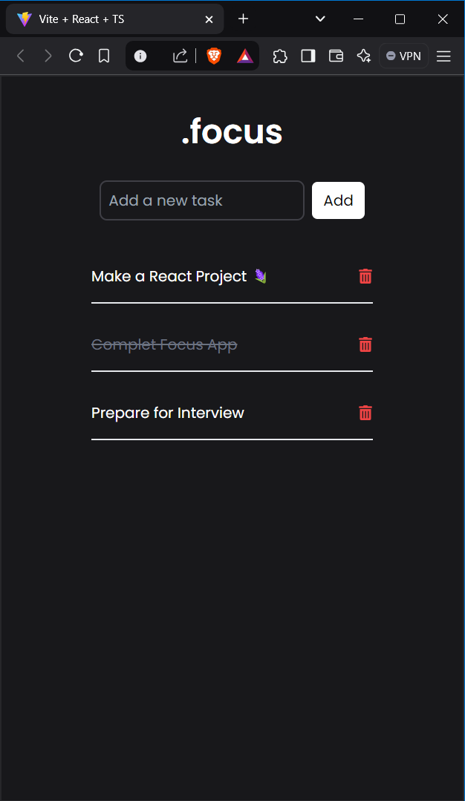

# Focus - Task Manager App

## Overview

**Focus** is a simple task manager application built with React. It allows users to add, delete, mark tasks as completed, and persist tasks using local storage. The application is designed to help users efficiently manage their tasks in a clean and intuitive interface.

[Live Link](https://task-manager-nu-wheat.vercel.app/)

## Features

1. **Task Input**: Add new tasks with a title.
2. **Task Completion**: Mark tasks as completed or incomplete with a single click (crosses out completed tasks).
3. **Task Deletion**: Delete tasks from the list.
4. **Local Storage Persistence**: Retain tasks across page refreshes by saving them in the browser's local storage.

## Setup and Launch

1. **Clone the Repository**:

   ```bash
   git clone <repository-url>
   cd focus-task-manager
   ```

2. **Install Dependencies**:

   ```bash
   npm install
   ```

3. **Run the Application**:

   ```bash
   npm start
   ```

4. **Access the App**:
   - Open your browser and go to `http://localhost:3000`.

## Assumptions Made

- Each task only requires a title. No additional details or descriptions are included in the task structure.
- Tasks are stored and retrieved from `localStorage`, which allows persistence only within the same browser environment.
- The user interface is responsive but primarily designed for desktop.

## Screenshots



## Technologies Used

- **React**: Framework for building the UI.
- **TypeScript**: Ensures type safety and better code maintainability.
- **Tailwind CSS**: Styles the UI with custom and reusable classes.
- **Local Storage**: Stores tasks persistently across sessions.

Enjoy staying organized with **Focus**!
